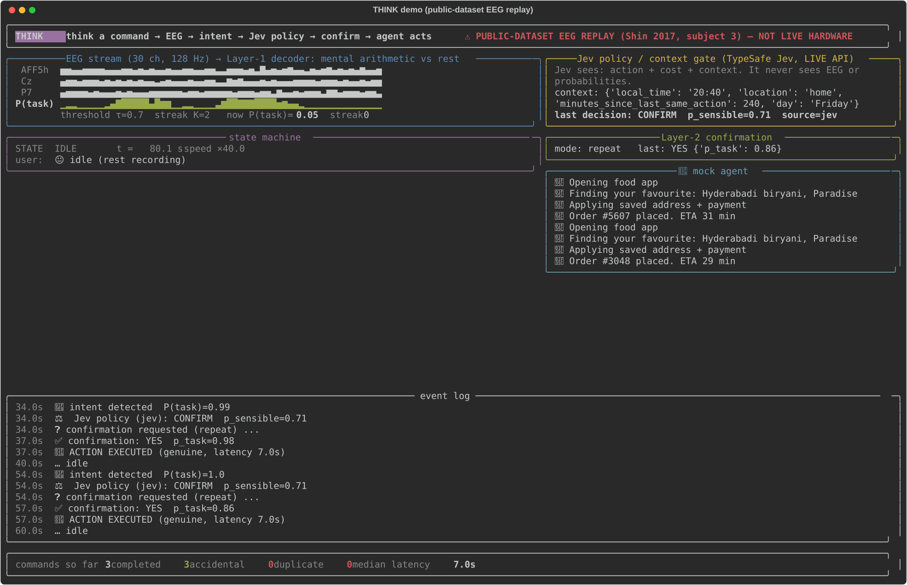

# THINK: think a command → EEG → intent → Jev policy → confirm → agent acts

An offline, end-to-end prototype of a "brain speed-dial" for AI agents, built entirely on **public EEG datasets
replayed sample-by-sample as if they were coming from a headset**. No live hardware was used anywhere in this repo.



## 30-second demo

```
git clone https://github.com/AshwaniKottapalli/brain-speeddial-eeg-jev && cd brain-speeddial-eeg-jev
./run_demo.sh
```

That single command creates the environment on first run, then replays subject 3 of the Shin 2017 dataset at 2x
speed: about 40 seconds of idle and three "think ORDER FOOD" episodes. You watch the Layer-1 probability climb,
the intent fire, Jev's policy decision, the confirmation window resolve, and the mock agent place the order.
It ends with a completed / accidental / latency footer and saves `results/demo_screenshot.svg`.

The first run also downloads Shin 2017 A and B via MOABB (about 5 GB, one time). Useful variants:

```
./run_demo.sh --confirm imagery      # confirm with a separate YES/NO imagery task instead of repeating the command
./run_demo.sh --confirm none         # single layer: act straight after detection
./run_demo.sh --speed 1              # real time
./run_demo.sh --no-jev               # rule fallback instead of the live Jev API for the policy gate
./run_demo.sh --context '{"location":"home","minutes_since_last_same_action":4}'   # watch Jev block a redundant order
./run_demo.sh --metrics              # headless end-to-end metric, 10 subjects x 5 folds x 3 confirm modes (~8 min)
```
Set `TYPESAFE_API_KEY` in `.env` for the live Jev gate; without it the gate runs a labelled rule fallback.

## Architecture

```
 public EEG recording (Shin 2017B: mental subtraction vs rest; Shin 2017A: left/right imagery)
          │  held-out trials only; 30 ch @ 128 Hz, 4-30 Hz
          ▼
 ┌───────────────────┐  one sample at a time, real-time paced
 │  ReplaySource     │  a SimulatedUser picks what the person is doing: idle / thinking the command /
 │  (stream.py)      │  answering YES. Every sample carries ground truth for scoring.
 └────────┬──────────┘
          ▼ 3 s window every 1 s
 ┌───────────────────┐   Riemannian covariance → tangent space → logistic regression
 │  Layer 1 decoder  │   P(mental arithmetic)   [trained per subject on the other 4 folds]
 └────────┬──────────┘
          ▼ streak: K=2 consecutive windows with P ≥ τ=0.7
 ┌───────────────────┐   IDLE → DETECTED → GATE → CONFIRMING → EXECUTE → COOLDOWN → IDLE
 │  State machine    │
 │  (fsm.py)         │
 └───┬───────────┬───┘
     ▼           ▼
 ┌─────────┐  ┌──────────────────────────────────────────────────────────────┐
 │ Jev     │  │ Layer 2 confirmation (one of):                                │
 │ policy  │  │  repeat  : Layer-1 decoder on the next 3 s window (keep      │
 │ gate    │  │            thinking the command = YES)                        │
 │(policy) │  │  imagery : 3-class yes / no / idle decoder on the next 4 s    │
 └────┬────┘  │            (left-hand imagery = YES, right = NO, idle class)  │
      │       └──────────────────────────────┬───────────────────────────────┘
      ▼                                      ▼
   fire / confirm / ignore              yes → EXECUTE, else abort
                                             ▼
                                   ┌───────────────────┐
                                   │  Mock agent       │  "Order #4821 placed. ETA 32 min"
                                   └───────────────────┘
```

**Where Jev is used, and where it deliberately is not.** TypeSafe's Jev is a hosted, text-only decision model
with no weights or fine-tuning. The experiments in `SPEEDDIAL_REPORT.md` section 5 showed it is *worse* than a
plain probability threshold at judging decoder evidence (AUC 0.58 vs 0.64) but useful at judging whether an
action is sensible in context (AUC 0.70). So in this demo **Jev never sees EEG or probabilities**. It receives
the proposed action, its cost, and the context (time, location, minutes since the same action) and answers one
yes/no question, "does this action make sense right now?", which code turns into fire / confirm / ignore.
With "an identical order was placed 4 minutes ago" it returns p = 0.04 and blocks the action; with the default
Friday-evening-at-home context it returns 0.71 and routes a money action to confirmation. The separate
"EEG → descriptor → Jev" experiment in `REPORT.md` is not part of this demo because a plain classifier matches it.

## End-to-end product metric (measured, not modelled)

`./run_demo.sh --metrics` replays **every held-out trial of 10 subjects x 5 folds** through the full pipeline
above, with the live Jev gate, as one continuous session per fold (30 command and 30 rest trials of 10 s each,
shuffled, so a command arrives every 20 s). It counts what a user would experience. A *duplicate* is a second
action fired for the same intentional command (ordering the same food twice); an *accidental* action is one
fired during idle.

Default settings (τ 0.7, K 2, 8 s refractory period after any action or abort):

| confirmation | intentional commands | detected | actions completed | duplicates | accidental during 0.83 idle h | accidental per idle hour | median latency |
|---|---|---|---|---|---|---|---|
| none (single layer) | 300 | 285 | **285 (95.0%)** | 0 | 23 | **27.6** | 4.0 s |
| repeat the command | 300 | 259 | **205 (68.3%)** | 0 | 5 | **6.0** | 7.9 s |
| imagery YES/NO + idle | 300 | 281 | **134 (44.7%)** | 0 | 1 | **1.2** | 8.0 s |

Same run with a 3 s refractory period (`--cooldown 3`):

| confirmation | detected | actions completed | duplicates | accidental per idle hour | median latency |
|---|---|---|---|---|---|
| none | 290 | 290 (96.7%) | **233** | 36.0 | 4.0 s |
| repeat | 285 | 238 (79.3%) | 25 | 6.0 | 7.0 s |
| imagery | 290 | 179 (59.7%) | 66 | 1.2 | 8.9 s |

Two things the streaming demo shows that per-trial experiments could not:

- **The refractory period is a real product trade-off.** With 8 s, no duplicates, but the dense test protocol
  (a command every 20 s) loses 41 repeat-mode commands at detection because the cooldown from the previous event
  is still running. With 3 s, completions recover to 79% but the single-layer system fires 233 duplicate orders,
  because the person keeps thinking the command for 10 s and the detector keeps firing. Confirmation layers
  suppress duplicates as a side effect (25 and 66 instead of 233).
- **Where commands are lost.** Repeat-confirm loses 54 of 259 detected commands at confirmation: the fire came
  too late in the 10 s trial for a 3 s confirmation window to fit, or the person's task probability dipped.
  Imagery-confirm loses 147 of 281, because left/right imagery decodes at only about 70% for most of these
  subjects (23% to 70% success per subject).

**Comparison with the offline experiments** (`SPEEDDIAL_REPORT.md` s7, same decoders, isolated per-trial
scoring, no state machine): single layer 96% / 27.6 per hour, repeat 83% / 4.8 per hour, imagery 47% / 1.2 per
hour. The demo reproduces the accidental-action side almost exactly; completion is a few points lower because a
real state machine carries cooldowns and late fires across segments.

Bottom line: **the confirmation layer cuts accidental actions 4.6x (repeat) to 23x (imagery)**, at a cost of
27 to 50 points of completion and 3 to 4 s of latency. Repeat-the-command is the practical default; imagery
confirmation is the safe setting for money actions if you accept that half of genuine commands need a second try.

## THINK benchmark v0: 20 intents, one trigger, EEG confirmation

`experiments/think_benchmark.py` drives a 20-intent agent menu (switch scanning, hierarchical 4 x 5, sorted by
usage) with the single mental-arithmetic trigger, and asks "Do you want to <intent>?" through an EEG YES/NO.
10 subjects x 5 folds x 20 intentional attempts, all real held-out EEG replayed sample by sample. Full tables,
the yes/no paradigm comparison across five public datasets, and caveats: `THINK_BENCHMARK.md`.

| configuration | intentional attempts | agent did it correctly | agent did something unasked | median time-to-action |
|---|---|---|---|---|
| no confirmation | 1000 | 817 (81.7%) | 307 (13.5 per hour) | 38 s |
| repeat-the-command confirmation (real EEG) | 1000 | **811 (81.1%)** | **52 (2.0 per hour)** | 45 s |
| left/right imagery confirmation (real EEG) | 1000 | 707 (70.7%) | 12 (0.3 per hour) | 61 s |
| P300 confirmation, 5 flashes (statistical splice, other subjects) | 1000 | 809 (80.9%) | 10 (0.4 per hour) | 39 s |

The best all-real-EEG YES/NO we found in public data is a two-option visual P300: with an idle-safe margin it
accepts 97% of intended YES answers, produces zero false YES, and says YES on 5% of idle EEG in 2.5 s
(BNCI2014_009, 10 subjects). Our current left/right imagery confirmation is 62% and says YES on 41% of idle EEG.

## What is real and what is simulated

| Component | Status |
|---|---|
| EEG signal | **Real recordings**, public Shin 2017 A/B (10 subjects, 30 ch). Replayed one sample at a time. Not live. |
| "Thinking the command" | Real: the subject was performing mental subtraction in that trial. Not a chosen phrase, a deliberate mental task. |
| "Answering YES" | Real left-hand imagery trials from the same subject, spliced in when the system asks. Mapping left = YES is ours. |
| Idle periods | Real rest recordings. Quiet fixation, so real life will produce more false alarms than measured here. |
| Decoders | Real, trained on the other 4 folds; evaluated on held-out trials only. Same recipe as the reports. |
| Jev policy gate | Real live API calls (cached). Rule fallback is used and labelled if no key is set. |
| Context (time, location, last order) | Simulated. |
| Agent actions | Mock. Text only, logged to `results/demo_actions.jsonl`. Nothing is ordered. |
| Filtering | Zero-phase bandpass applied per trial before replay (matches the experiments). A live system must use a causal filter. |

## Limitations

- **One command.** The strongest decodable public task is mental arithmetic vs rest, so the speed-dial has one
  slot. Adding slots needs more distinct mental tasks recorded from the same person.
- **Consumer headsets lose most of it.** A simulated 4-channel Muse-like montage drops detection from 96% to
  77% at the same false-alarm rate, and to 39% once you demand one false trigger per 5 minutes
  (`SPEEDDIAL_REPORT.md` s4b).
- **Confirmation is the bottleneck**, not detection. Left/right imagery as YES/NO works for 2 of 10 subjects
  above 90% and near chance for 4 of 10.
- **Imagined words do not work.** Inner speech decodes at chance on 128 channels; this repo does not read
  words or sentences (`SPEEDDIAL_REPORT.md` s2).
- **Dense test protocol.** Commands every 20 s exaggerate cooldown effects; real usage is a few commands an hour.
- **Rest is not real idle.** Talking, chewing, walking will raise false alarms above the 27 per hour measured.
- **Within-subject only.** Every decoder is personal, trained on about 8 minutes of that person's data. Nothing
  here transfers across people.

## What changes with real hardware

1. `ReplaySource` is replaced by a Bluetooth LSL stream (e.g. `muselsl`); the FSM already consumes one sample at a time.
2. Causal filtering: replace the per-trial zero-phase filter with a stateful `sosfilt`; retrain on causally filtered calibration data.
3. A 10-minute calibration session replaces the dataset folds: 30 x 10 s of the command task, of rest, and of the confirmation task.
4. Artefact handling: eye blinks and jaw clenches are absent from these curated datasets. A jaw clench is also the
   cheapest near-100% confirm signal on a consumer headset and should replace or back up imagery confirmation.
5. Expect the 4-channel numbers, not the 30-channel ones, unless you use a research cap.
6. Jev stays exactly where it is: context and policy. The real agent replaces `MockAgent`.

## Repo map

- `demo.py`, `run_demo.sh`: the demo and its one-line launcher. `think_demo/`: stream, decoder, fsm, policy, agent, ui, metrics.
- `REPORT.md`: can Jev learn EEG? (No. Trained encoder → 3-word descriptor → frozen Jev = 73.7%, equal to a plain classifier.)
- `SPEEDDIAL_REPORT.md`: command detection, channel ablation, Jev gate, two-layer confirmation experiments.
- `eeg_jev/`, `experiments/`: the research code behind both reports. `results/`: JSON outputs and figures.

Datasets download automatically: PhysioNet EEGMMIDB, BCI Competition IV 2a, Shin 2017 A/B (MOABB), Nieto 2022
(OpenNeuro). Total Jev API spend for everything in this repo: under $1. License: MIT.
